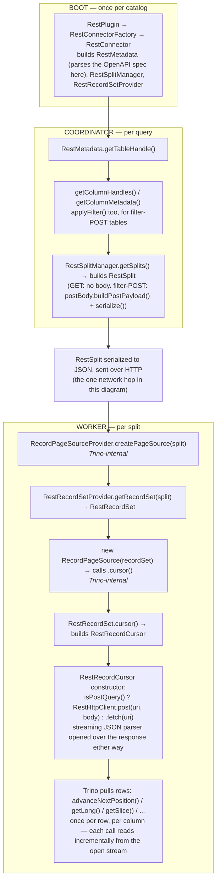
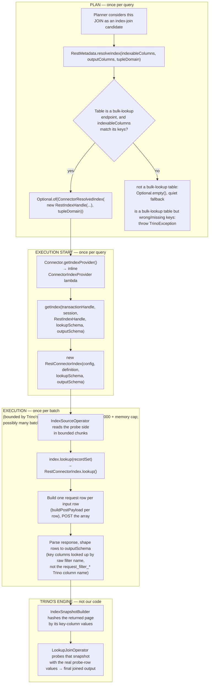

# Architecture

How this connector is put together, and what actually happens between a client
running a query and rows coming back.

## Two packages, two concerns

- **`io.trino.plugin.rest.openapi`** — turns an OpenAPI spec into this
  project's own plain data model (`EndpointDefinition`, `ColumnDefinition`,
  `PostBodyDefinition`, `PostFilterDefinition`). Nothing in this package
  imports Trino's SPI. `OpenApiSchemaParser` is the entry point.
- **`io.trino.plugin.rest`** — the actual Trino connector. Every class here
  either implements a Trino SPI interface, or directly supports one that does.

## Class reference

| Class | Implements | Role |
|---|---|---|
| `RestPlugin` | `Plugin` | Entry point Trino discovers via `ServiceLoader`; hands back a `RestConnectorFactory`. |
| `RestConnectorFactory` | `ConnectorFactory` | Builds one `RestConnector` per catalog, from `rest.properties`. |
| `RestConnector` | `Connector` | Owns `RestMetadata`, `RestSplitManager`, `RestRecordSetProvider`; answers `beginTransaction()` and `getIndexProvider()` (an inline `ConnectorIndexProvider` lambda for the bulk-lookup/index-join path). |
| `RestTransactionHandle` | `ConnectorTransactionHandle` | Stateless singleton enum (`INSTANCE`) — this connector has no real transactions. |
| `RestMetadata` | `ConnectorMetadata` | Table/column discovery; WHERE-clause pushdown (`applyFilter`) for filter-POST tables; index-join feasibility (`resolveIndex`) for bulk-lookup tables. Owns `tableNameToEndPointDefinition`, built once at construction via `OpenApiSchemaParser.parse()`. |
| `RestTableHandle` | `ConnectorTableHandle` | Wraps a `SchemaTableName` plus `resolvedFilterValues` — WHERE-clause values resolved for filter-POST tables, accumulated across `applyFilter` rounds. |
| `RestColumnHandle` | `ColumnHandle` | `columnName` + `columnType`; can rebuild a full `ColumnMetadata` on demand. |
| `RestIndexHandle` | `ConnectorIndexHandle` | Just a `SchemaTableName` — lets `resolveIndex()` and `getIndexProvider()`'s `getIndex()` agree on which endpoint a given index-join is for. |
| `RestSplitManager` | `ConnectorSplitManager` | Turns a table handle into split(s). Currently always exactly one `RestSplit` per query — no partitioning. |
| `RestSplit` | `ConnectorSplit` | `uri` + the endpoint's `EndpointDefinition`, plus an optional pre-built request body (filter-POST tables). |
| `RestRecordSetProvider` | `ConnectorRecordSetProvider` | Given a split + selected columns, builds a `RestRecordSet`. |
| `RestRecordSet` | `RecordSet` | Thin, lazy wrapper — `.cursor()` builds a `RestRecordCursor`. |
| `RestRecordCursor` | `RecordCursor` | Constructor fires the request and opens a streaming JSON parser over the response. Every `advanceNextPosition()`/getter call reads incrementally from that stream — nothing is buffered as a full in-memory list. |
| `RestConnectorIndex` | `ConnectorIndex` | `lookup(RecordSet)` — the actual per-batch HTTP call for the bulk-lookup/index-join path: builds the request array from the batch's key rows, POSTs it, parses the response, returns a page shaped to the requested output columns. |
| `RestHttpClient` | *(plain helper)* | Builds and sends the actual `java.net.http.HttpRequest` (GET or POST) with the bearer token. |
| `RestConfig` | *(plain helper)* | Parses `rest.token` / `rest.specUrl` / `rest.specPath` / `rest.baseUrl` from catalog properties. |
| `OpenApiSchemaParser` | *(plain helper)* | Fetches + parses the OpenAPI spec into `EndpointDefinition`s. |
| `EndpointDefinition` | *(plain record)* | One REST endpoint: path, table name, response columns, whether the response is a root array, and an optional `PostBodyDefinition` for POST-backed tables (filter-POST or bulk-lookup, distinguished by `PostBodyDefinition.isRootArray()`). |
| `ColumnDefinition` | *(plain record)* | One response field: name + Trino type. |
| `PostBodyDefinition` | *(plain record)* | POST request template (`requestBody`), its filter/key fields (`filters`), and whether the body is a root array. `buildPostPayload` fills the template from resolved values; `serialize` turns any filled object (or batch of them) into the final JSON string. |
| `PostFilterDefinition` | *(plain record)* | One POST-body field usable as a WHERE-clause filter or index-lookup key: raw name, Trino type, required-ness, whether it's array-typed, and its path into the template. `columnName()` is the Trino-visible name (`request_filter_`-prefixed); `name()` is the raw field name the target API actually uses. |

All the "wire types" — `RestTableHandle`, `RestColumnHandle`, `RestSplit`,
`RestIndexHandle`, `EndpointDefinition`, `ColumnDefinition`,
`PostBodyDefinition`, `PostFilterDefinition` — are explicitly `@JsonCreator`/
`@JsonProperty` annotated. That's not stylistic: Trino ships these objects
from the coordinator to a worker as JSON (see below), and a plain Java
object with no annotations — or worse, an anonymous class — will fail to
serialize at query time rather than at compile time. See
`io.trino.plugin.example.ExampleColumnHandle`/`ExampleTransactionHandle` in
Trino's own `trino-example-http` connector for the reference pattern this
project follows.

## Query lifecycle

There are three distinct query paths through this connector — GET, single-object
filter-POST, and bulk-lookup/index-join — depending on how a table's endpoint is
described. `FLOWS.md` walks through all three end-to-end, including exactly
which method gets called when and how many times. This section has two
diagrams: the first covers GET and filter-POST together (they share the same
classes, differing only in whether `RestHttpClient.fetch()` or `.post()` gets
called), the second covers the structurally different bulk-lookup/index-join
path.

### GET and filter-POST paths

Boot happens once per catalog. Everything under **PLAN** happens once per
query. The only network hop between coordinator and worker in this diagram
is the split itself; the actual HTTP request to the target API happens on
the worker.

A few things worth calling out explicitly:

- **`getRecordSet()` does no I/O.** It just constructs a `RestRecordSet`
  holding the split/config/columns. The actual HTTP request only fires one
  hop later, inside `RestRecordCursor`'s constructor, when something calls
  `RecordSet.cursor()`.
- **The request fires eagerly, but the response is parsed incrementally, never
  buffered.** `RestRecordCursor`'s constructor opens the connection and hands
  the response body to Jackson's streaming `JsonParser` (through a
  byte-counting wrapper, `CountingInputStream`) — it does not read the whole
  body into a `String` or build a `List` of parsed rows up front.
  `advanceNextPosition()` pulls the next JSON value off that same open
  stream each time it's called, so peak memory stays bounded regardless of
  response size. This is the connector's core architectural bet — see
  `COMPARISON.md` for a live measurement (~32MB vs. 12GB+ peak memory)
  against a connector that does buffer the full response.
- **`RecordPageSourceProvider`/`RecordPageSource` are Trino's own classes**,
  not part of this project. They exist because this connector implements
  the simpler `ConnectorRecordSetProvider`/`RecordSet`/`RecordCursor` SPI
  rather than the lower-level `ConnectorPageSourceProvider`; Trino adapts
  between them automatically.

### Bulk lookup / index join path

Structurally different from the diagram above — no `RestSplitManager`,
`RestSplit`, or `RestRecordCursor` involved at all. This path exists because
an ordinary `JOIN` against a bulk-lookup endpoint (a POST whose request body
is a root JSON array of key-tuples) can't be served by a single split the
way GET/filter-POST tables are: the values to look up come from the other
side of the join, batch by batch, during execution — not from a `WHERE`
clause known at planning time.

The key thing this diagram makes explicit that the GET/filter-POST one
doesn't: `RestConnectorIndex.lookup()` (the `Batch` subgraph) can run many
times for one query — once per bounded chunk of the probe side — while
`resolveIndex` and `getIndex` each run exactly once. See `FLOWS.md`'s "bulk
lookup / index join" section for the full narrative, including the
key-column lookup bug that lived in step `L` until it was found and fixed.

## What's not implemented yet

Path parameters (`/users/{id}`) are unsupported, and splitting always
produces exactly one split (no parallelism) for GET and filter-POST tables.
WHERE-clause pushdown for filter-POST tables (`RestMetadata.applyFilter()`)
and index-join support for bulk-lookup tables (`RestMetadata.resolveIndex()`)
are both implemented — see `FLOWS.md` for how each works end-to-end. See
`TODOS.md` for what's still open.
